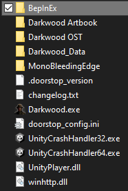

# StackResizer

A mod for darkwood that changes item stack sizes and optionally lets you repair the lantern using any item
You can find versions of the dll in every commit change and download it

## Installation

This mod uses BepInEx for it's loader, you can download BepInEx [here](https://github.com/BepInEx/BepInEx/releases)
The mod was made on [BepInEx version 5.4.23.2](https://github.com/BepInEx/BepInEx/releases/tag/v5.4.23.2)
Download BepInEx and unzip it into your game folder and then put this mod (StackResizer.dll) into BepInEx/plugins/
The directory should look like this:\

It doesn't matter how you install the mod into the plugin folder just so long as it's there BepInEx will look for DLLs in that folder

- BepInEx
  - plugins
    - StackResizer.dll

## Configuration

You can change configurations of the mod inside Bepinex/Config and opening the .cfg with a text editor, yes, you can use notepad.
Notice: For this mod specifically the stacks for some items won't reload until you exit and enter your save
